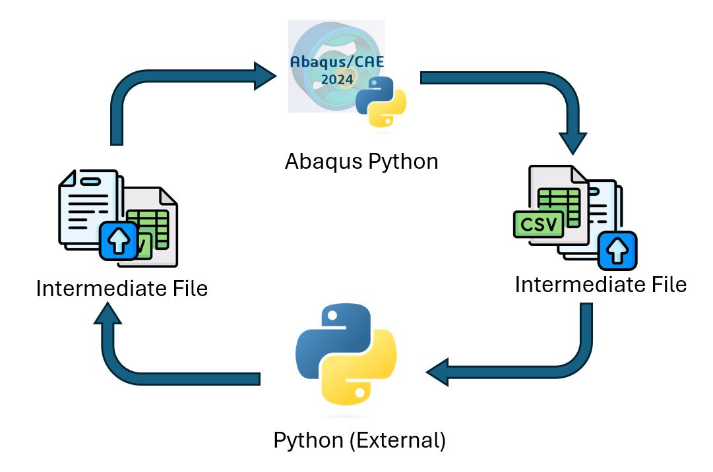
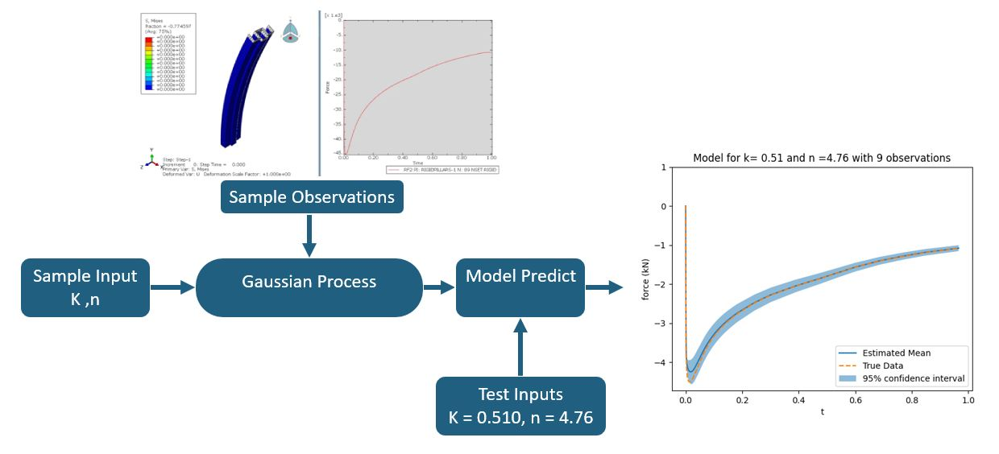
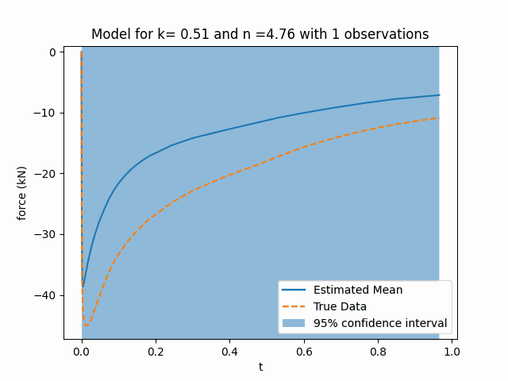

# Extending Abaqus to third party libraries (sklearn)

This example demonstrates how to link Abaqus python scripting to third party libraries such as `pandas` and `sklearn`. Abaqus software uses a specially compiled version of python from the standard python distribution. As such we cannot directly link third party packages to Abaqus. 

We can, however, indirectly link Abaqus to these 3rd party libraries. To do so we essentially have 2 processes/python scripts running: Abaqus python (which does the pre-post processing of our FEA model) and 'external' python which runs our third party libraries such as `sklearn`.


<a href="https://www.flaticon.com/free-icons/csv" title="csv icons">Csv icons created by Freepik - Flaticon</a>

<a href="https://www.flaticon.com/free-icons/submit" title="submit icons">Submit icons created by Freepik - Flaticon</a>


We can run Abaqus python inside our external python script (or vice versa) using the built-in `subprocess` module which essentially allows users to run terminal/CMD prompt based commands:

```python
import subprocess
subprocess.run(['abaqus', 'cae', 'noGui=YourScriptHere.py'],shell = True)
```

We also need a way to communicate between different python processes. The most straightforward is to create intermediate files that both processes can understand such as:
- CSV files
- .npy files
- .mat files

**NOTE The example code is intended to run with Abaqus 2024 which uses python 3.10. This will note work if run using older Abaqus versions which use python 2.7.** However the above linking will work for older Abaqus versions. The external python used was python 3.9 and can be independent version to Abaqus python. 


## Example

We create a simple surrogate model of the buckling column found [here](https://help.3ds.com/2023/english/dssimulia_established/simacaeexarefmap/simaexa-c-bucklespotweld.htm?contextscope=all):


The surrogate model is created using a gaussian process from sklearn. the x samples are the Ramberg-Osgood parameters ($K,n$) for metal plasticity:

$$
\varepsilon = \frac{\sigma}{E} + (\frac{\sigma}{K})^n 
$$

Here $K \in [0.3,0.65]$ with dimensions GPa and $n \in [3,6]$

Our goal is to map the material parameters $(K,n)$ to the force-time graph in the above animation using a gaussian process.



We use 9 different combinations of $K,n$ in a 3x3 grid pattern to create the surrogate model and then test our results for $K,n = (0.510,4.76)$:



# Main Files
## pillar.cae
The abaqus model for the buckling column. The model is already completed and we only change the material properties

## pillar.py
This is the abaqus script that modifies the material properties (i.e metal plasticity) by reading in `params.csv`. The script then creates the abaqus jobs and runs it. Afterwards, the force-time curve is extracted from the results

## external.py
The external python process writtern as a script. As it is separate from Abaqus python, it can freely use third party tools and packages (in this case `sklearn`). It runs the script `pillar,py` via `subprocess`

## external.ipynb
The external python process written in the form of a jypyter notebook. Allows for easier iterations when designing plots

## functions.py
Some helper functions. Demonstrates that certain custom python code can be freely used between the two python versions. If you are mixing code like this, one should limit third party library code to `numpy` and `scipy` only.

## CSV Files
### original_force.csv
Test data to compare final model against
### params.csv
intermediate file containing material parameters to use for the current iteration

Within `Results/<iteration>/` there also exists a `params.csv` file which contains the materials parameters used for that iteration
### hardening.csv
Stresses to calculate plastic strain at based on material parameters
### force.csv
Found in `Results/<iteration>/`. Contains the force-time data from the results of that iteraction

## Other
Other files are those generated by Abaqus. If you want to visualize the results of an iteration in Abaqus, please refer to the odb file found in `Results/<iteration>/`


# How to run

**NOTE The example code is intended to run with Abaqus 2024 which uses python 3.10. This will note work if run using older Abaqus versions which use python 2.7.** The external python used was python 3.9.

You will first need to have a valid Abaqus 2024 version and access to a license.

Clone this repository or download it as a zip and extract the contents
```bash
git clone https://github.com/JohnCSu/Abq_2_ThirdPartyLibrary.git
```

Install requirements (mainly just numpy and sklearn)
```bash
cd Abq_2_ThirdPartyLibrary
pip install -r requirements.txt
```

Then open up the `external.ipynb` or `external.py` and run!

# License
MIT